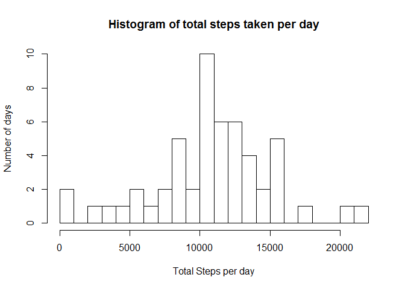
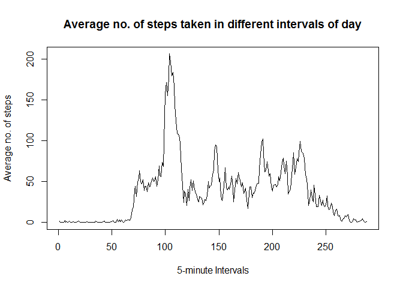
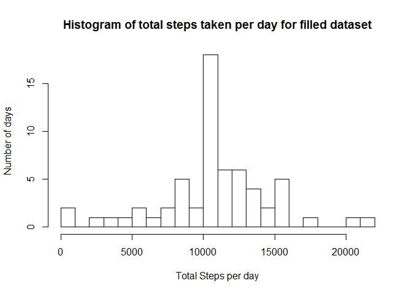
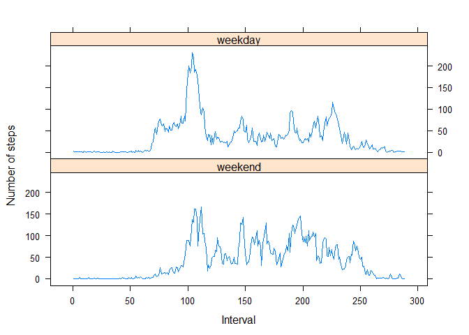

# Reproducible Research: Peer Assessment 1
Vishal Jain  
## Loading and preprocessing the data

```r
unzip("./repdata-data-activity.zip", exdir = "./data")
activity <- read.csv("./data/activity.csv")
activity <- transform(activity, date = as.Date(date,format = "%Y-%m-%d"))
summary(activity)
```

```
##      steps             date               interval     
##  Min.   :  0.00   Min.   :2012-10-01   Min.   :   0.0  
##  1st Qu.:  0.00   1st Qu.:2012-10-16   1st Qu.: 588.8  
##  Median :  0.00   Median :2012-10-31   Median :1177.5  
##  Mean   : 37.38   Mean   :2012-10-31   Mean   :1177.5  
##  3rd Qu.: 12.00   3rd Qu.:2012-11-15   3rd Qu.:1766.2  
##  Max.   :806.00   Max.   :2012-11-30   Max.   :2355.0  
##  NA's   :2304
```
## What is mean total number of steps taken per day?

```r
stepPerday <- with(activity, tapply(steps, date, sum))
hist(stepPerday, main ="Histogram of total steps taken per day", xlab = "Total Steps per day", ylab = "Number of days", breaks = 30)
```

 

```r
meanStepsPerday <- round(mean(stepPerday, na.rm = T), 2)
medStepsPerday <- round(median(stepPerday, na.rm = T),2)
```
The mean of total steps per day is **10766.19** and the median of same is **10765**.

## What is the average daily activity pattern?

```r
avgStepsPerInt <- with(activity, tapply(steps, interval, mean, na.rm = T))
plot(avgStepsPerInt, type = "l", main = "Average no. of steps taken in different intervals of day", xlab = "5-minute Intervals", ylab = "Average no. of steps")
```

 

```r
maxIntv <- names(which.max(avgStepsPerInt))
```
### Which 5-minute interval, on average across all the days in the dataset, contains the maximum number of steps?
The **835th** 5-min interval has the maximum number of steps!

## Imputing missing values.
### Calculate and report the total number of missing values in the dataset.

```r
NArows <- !complete.cases(activity)
numNArows <- sum(NArows)
```
**2304** values are missing in the dataset.

### Devise a strategy for filling in all of the missing values in the dataset.
We use the mean for that 5-minute interval for which value is missing.
### Create a new dataset that is equal to the original dataset but with the missing data filled in.

```r
NArows <- !complete.cases(activity)
numNArows <- sum(NArows)
temp <- as.character(activity[NArows,]$interval)
NAdInt <- unique(temp)
avgIntVal <- avgStepsPerInt[NAdInt]
activity_complete <- activity
activity_complete[NArows,]$steps <- (avgIntVal[temp])
summary(activity_complete)
```

```
##      steps             date               interval     
##  Min.   :  0.00   Min.   :2012-10-01   Min.   :   0.0  
##  1st Qu.:  0.00   1st Qu.:2012-10-16   1st Qu.: 588.8  
##  Median :  0.00   Median :2012-10-31   Median :1177.5  
##  Mean   : 37.38   Mean   :2012-10-31   Mean   :1177.5  
##  3rd Qu.: 27.00   3rd Qu.:2012-11-15   3rd Qu.:1766.2  
##  Max.   :806.00   Max.   :2012-11-30   Max.   :2355.0
```
### Make a histogram of the total number of steps taken each day and Calculate and report the mean and median total number of steps taken per day. 

```r
stepPerday2 <- with(activity_complete, tapply(steps, date, sum))
hist(stepPerday2, main ="Histogram of total steps taken per day for filled dataset", xlab = "Total Steps per day", ylab = "Number of days", breaks = 30)
```

 

```r
meanStepsPerday2 <- round(mean(stepPerday2, na.rm = T), 2)
medStepsPerday2 <- round(median(stepPerday2, na.rm = T),2)
```
The mean of total steps per day in the filled dataset is **10766.19** and the median is **10766.19**. As one can notice, the mean of two datasets remains the same whereas the median becomes equal to the mean in imputed dataset. Reason being, the NAs introduced bias in the original dataset and after substituting these NAs with the mean value, distribution became symmetric with mode and mean being equal.
The total number of steps for the filled dataset has gone up to **656738** from **570608** for the original dataset.

## Are there differences in activity patterns between weekdays and weekends?
### Create a new factor variable in the dataset with two levels - "weekday" and "weekend" indicating whether a given date is a weekday or weekend day.

```r
randMonth <- seq.Date(as.Date("1999-11-07"),as.Date("1999-12-07"),"day")
days <- unique(weekdays(randMonth))
activity_complete <- transform(activity_complete, day = factor(weekdays(date), levels = days))
levels(activity_complete$day) <- c("weekend",rep("weekday", 5),"weekend")
summary(activity_complete$day)
```

```
## weekend weekday 
##    4608   12960
```
### Make a panel plot containing a time series plot (i.e.  type = "l" ) of the 5-minute interval (x-axis) and the average number of steps taken, averaged across all weekday days or weekend days (y-axis).

```r
temp1 <- as.data.frame(xtabs(steps~day+interval, data = activity_complete))
temp1 <- with(temp1, temp1[order(day,interval),])
class(temp1$interval) <- "numeric"
temp1$Freq[temp1$day%in%"weekday"] = temp1$Freq[temp1$day%in%"weekday"]/table(activity_complete$day,activity_complete$interval)['weekday','2210']
temp1$Freq[temp1$day%in%"weekend"] = temp1$Freq[temp1$day%in%"weekend"]/table(activity_complete$day,activity_complete$interval)['weekend','2210']
library(lattice)
xyplot(Freq~interval|day,data = temp1, type='l',layout = c(1,2), xlab = "Interval", ylab = "Number of steps")
```

 
